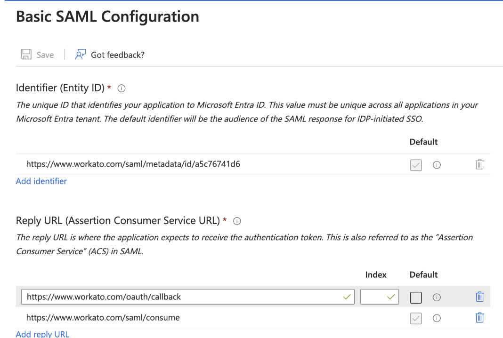

# SSO & SCIM Configuration

### **What is Single Sign-On (SSO)?**
**Single Sign-On (SSO)** allows users to access Workato using their corporate Entra ID credentials. This eliminates the need for multiple logins and improves **security, ease of access, and centralized identity management**.

### **What is SCIM Provisioning?**
**System for Cross-domain Identity Management (SCIM)** automates user provisioning and role management in Workato based on their group assignments in Entra ID. SCIM ensures:
- **Automatic user creation and deletion** in Workato.
- **Role-based access control** (RBAC) mapped from Entra ID groups.
- **Dynamic updates** when user roles change in Entra ID.

---

## Step 1: Set Up SSO in Microsoft Entra ID

To enable **SSO for Workato**, follow these steps:

=== "Entra Configuration"
    1. **Log in to Microsoft Entra Admin Center**.
    2. Navigate to: `Azure Active Directory` → `Enterprise Applications`.
    3. Click **New Application** → **Create Your Own Application**.
    4. **Provide Name:** `Workato HQ`.
    5. Click **Create**.
    6. **Configure SAML SSO:**
       - **Entity ID:** `https://www.workato.com/oauth/callback`
       - **Reply URL:** `https://www.workato.com/saml/consume`
    7. Copy Metadata URL from Entra and paste it into Workato under **MetaData URL**.

**Example Screenshot: Configuring SSO in Microsoft Entra ID**

  

 

### **Mapping Entra ID Groups to Workato Roles**
To control user access, map **Entra ID security groups** to Workato roles:

| **Entra Group Name**                     | **Workato Role**  | **Access Level** |
|------------------------------------------|------------------|-----------------|
| `Workato_MasterChef_SSO`                 | **MasterChef**   | Admin access to manage all settings. |
| `Workato_Chef_SSO`                       | **Chef**         | Read/Write access to automations. |
| `Workato_SousChef_SSO`                    | **SousChef**     | Read-only access for monitoring. |

This ensures **RBAC (Role-Based Access Control)** is enforced in all Workato workspaces.

---

## Step 2: Enable SCIM Provisioning

SCIM provisioning automates **user role assignments and deprovisioning**.

### **Steps to Enable SCIM in Workato**
=== "Workato SCIM Setup"
    1. **Log in to Workato HQ**.
    2. **Navigate to:** `Settings` → `User Provisioning (SCIM)`.
    3. **Enable SCIM provisioning.**
    4. Copy the **SCIM Base URL and Bearer Token** for Entra ID.
    5. **Go back to Entra ID** and enable **SCIM automatic provisioning**.

**Example Screenshot: Enabling SCIM in Workato**

  

??? info "Why Enable SCIM?"
    SCIM provisioning ensures that users **automatically receive the correct roles** in Workato based on their Entra group assignments. This eliminates the need for manual role management and improves **security, automation, and compliance**.

---

## Common Issues & Troubleshooting

### **🔹 Issue: User is Unable to Log In via SSO**
**Possible Causes & Fixes:**
| **Issue** | **Possible Cause** | **Solution** |
|-----------|--------------------|--------------|
| **User login fails** | User is not assigned to the Workato Enterprise Application in Entra ID | Add the user to the correct Entra security group (`Workato_Chef_SSO`, etc.). |
| **Incorrect role mapping** | The Entra ID group is not mapped to the right Workato role | Verify group-to-role mapping in Workato. |
| **SSO authentication errors** | Incorrect Entity ID or Reply URL | Double-check SAML configuration in Entra. |

---

## ✅ Final Verification

To ensure that SSO & SCIM provisioning are **fully functional**, perform the following checks:

1. **Test SSO Login:**  
   - Have a user log in via **SSO** to confirm authentication.
   - Verify their role assignment in Workato.

2. **Check SCIM User Sync:**  
   - Add a test user to an Entra ID security group.
   - Confirm that the user is **automatically provisioned** in Workato.

3. **Review Audit Logs:**  
   - Navigate to Workato’s **Audit Logs** to verify SCIM sync events.

✅ At this point, SSO & SCIM provisioning are **successfully configured**!

For further assistance, refer to **Microsoft Entra ID documentation** or reach out to the **Workato admin team**.
